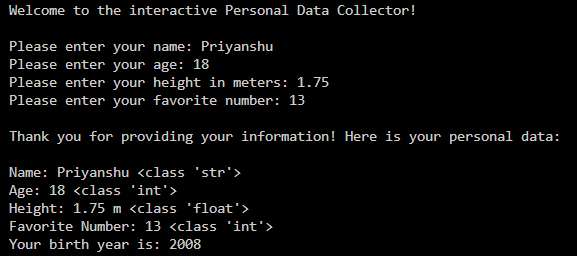

# Fundamental Booster

## Description
A simple and interactive Python command-line program that collects user information, checks that the entered data is valid, and estimates the user’s birth year.

## Preview


## Output

```
Welcome to the interactive Personal Data Collector!

Please enter your name: Priyanshu
Please enter your age: 18
Please enter your height in meters: 1.75
Please enter your favorite number: 13

Thank you for providing your information! Here is your personal data:

Name: Priyanshu <class 'str'>
Age: 18 <class 'int'>
Height: 1.75 m <class 'float'>
Favorite Number: 13 <class 'int'>
Your birth year is: 2008

Thank you for using the Personal Data Collector. Goodbye! Have a great day!
```